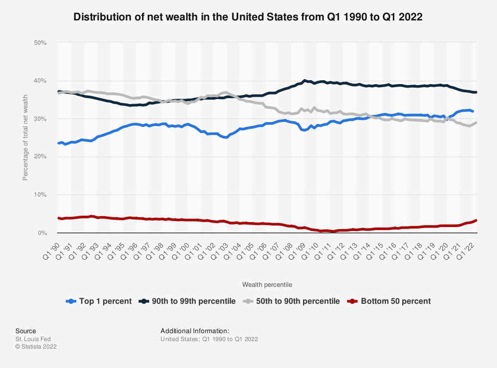

## Tax Returns
# Understanding the Tax Landscape in the US by Zip Code
#### Authors:
Shivesh Ummat summat@uw.edu, David Li laviddi@uw.edu, Ismail Ibrahim ishy206@uw.edu

#### INFO-201: Technical Foundations of Informatics - The Information School - University of Washington
#### Autumn 2022

### Abstract
We are concerned with the distribution of income and tax payments across the country based on geographical location, because we want to understand wealth inequality and uncover which areas of the US need the most financial subsidies from the government. To address this concern, we plan to analyze tax return data from the IRS in 2019 to understand tax brackets, income, and deductions based on zip code and state. Additionally, we want to know if high earners are abusing tax laws to write off their payments and we aim to quantify the pervasiveness of this problem.

### Keywords
Tax Returns, Income Distribution, Wealth Inequality, Deductions and Write Offs

### Introduction
Our project leverages IRS data from tax returns to examine the fiscal landscape in the US. Wealth and income inequality are becoming increasingly more drastic issues. Why is this? We will examine tax returns to understand how high earners might be taking advantage of tax law for financial gain while the real burden remains on the working class. Where does this happen? Are there hotspots of poverty in the US, and if so, why? We want to answer these questions by comparing income and tax payments across all the zip codes in the US. These might be areas that need government assistance to alleviate the stress of poverty. In addition, we want to begin to understand ways to close the wealth gap by examining which areas of the tax statistics seem to be imbalanced or unfair. This analysis will help inform governmental policy and advise the potential reorganization of tax structure to promote equality.

### Problem Domain
#### Project Framing
Taxes in the U.S. are an issue as old as the country itself. They exist on the notion that everybody pays their fair share: but is this true? The answer is no. The IRS projects that the amount of income tax money owed but not paid will be 540 billion dollars per year for 2017 to 2019, and that those referred to as high earners are responsible for a disproportionate share of these unpaid taxes [\[1\]](https://abcnews.go.com/Business/wireStory/irs-growing-gap-us-income-taxes-owed-paid-92304350). The latter does not come as a surprise, as prominent figures, such as Donald Trump, often appear in the media for keeping their tax returns private. In fact, recently, the former president filed a case to the Supreme Court requesting that they block the pending disclosure of his personal tax returns from House Democrats [\[2\]](https://www.cbsnews.com/news/donald-trump-tax-returns-supreme-court-request-to-shield-from-house-committee). With all this in mind, we seek to address issues related to wealth distribution and taxed income by state and nationally.

#### Direct and Indirect Stakeholders
**Policymakers** are direct stakeholders of the data we use and the results and visualizations we produce from it, as they may use this information to guide decisions related to income tax legislation at the federal and state level. Our data may prove useful to policymakers attempting to set state or federal tax brackets and tax rates for future years.

**Working class** people are indirect stakeholders of our data. They may not directly interact with this data but are still subject to its effects through tax laws at the state and federal level. These laws may cause individuals to relocate or seek different employment and may influence their votes and well-beings.

#### Human Values
Values: Equity, Justice
One important value concerning this project is equity. Taxes vary between individuals depending on the tax bracket they belong to, for example, which directly links the issue of taxes to the notion of equity. Below is a figure from Statistica describing the wealth distribution over the years between four different categories of earners [\[3\]](https://www.statista.com/statistics/299460/distribution-of-wealth-in-the-united-states/).

The figure shows an alarming disparity between earners. In general, the top ten percent of earners in the U.S. hold the majority of the country’s net wealth. So, we hope to narrow down areas facing the most financial hardship in order to provide them with equitable solutions. Another important value at stake here is justice, which is closely related to equity. In addition to providing equitable solutions, we hope that this project will help identify systemic causes for inequity in the U.S. and propose ways to fix them in order to provide long-term, equitable access to resources for future generations.

#### Potential Benefits and Harms
The results of this project have the potential to benefit the bottom fifty percent of earners. These are the people who suffer the most from the wealth gap and are most likely to require financial assistance. By narrowing down the locations of this group, we can imagine how and where to allocate additional resources in the pursuit of a more equitable society. On the other hand, this project has the potential to harm the top ten percent of earners: those who benefit from the wealth gap. Ensuring that this group pays their fair share of taxes can be seen as a harm because it shifts a proportional amount of the tax burden onto them.

### Research Questions
**What is the distribution of income over the United States based on Zip Code and State?**
We want to explore if there are certain states that have more concentrated wealth. This can show income inequality in the US. It is important for understanding which areas need the most financial subsidies and government assistance. If these tend to be the most metropolitan areas, how can we change tax law to provide help in large cities?

**Does wealth distribution change based on tax laws in different states?**
It may seem intuitive that states with lower personal income tax should have wealthier individuals. People pay less tax, and high earners may even be attracted to live in these states. Does this assumption hold true? Maybe high earners are equally spread across the country. Are there other forces at work that are worth exploring?

**Are taxes paid fairly or is the tax system abused by high earners?**
There is much discourse in the media about tax write offs and ways to avoid paying taxes. Does this happen as often as it’s made out to? Or do high earners pay their taxes fairly and contribute as much as they should? An analysis of tax payments grouped by tax brackets will help us answer this question.

**Are tax breaks and benefits to the working class enough?**
The trend in America shows the ever shrinking middle class. How does this happen? Low earners should be given tax breaks as they are already often working paycheck to paycheck. This might help pull low earners out of poverty and back into the middle class. However, due to the trend, we might hypothesize that tax breaks are not sufficient and should be increased.

### The Dataset
The data we are choosing to use is from the US Government, specifically the Internal Revenue Service (IRS). The data is called "Individual Income Tax Statistics" from 2019. This contains information on tax filings, income, returns, loans, deductions, and other monetary observations. It effectively has all the information input on a tax return, for every household in America. This data is grouped by zip code, and there is a separate file for each state in the US. There are 152 columns and 166,000 rows of data in the aggregated dataset. This dataset provides all the information to understand the fiscal landscape of the US based on geographical location. Nuances of tax law such as deductions and liabilities can be explored to understand if there is a trend that could be contributing to income disparities. This dataset will help us uncover the factors and locations of wealth inequalities in the US.

There is a file for each state, but the aggregated dataset already combined each file together. We plan to use the aggregated data:

| File                            | Number of Zip Codes | Number of Rows Per Zip Code  | Number of Observations
| ------------------------------- | ------------------- | ---------------------------- | ---------------
| Alabama  | 641              | 5 (one per tax bracket group)|  152
| Alaska  | 64              | 5 (one per tax bracket group)|  152
| Arizona  | 336              | 5 (one per tax bracket group)|  152
| Arkansas  | 556              | 5 (one per tax bracket group)|  152
| California  | 1689              | 5 (one per tax bracket group)|  152
| ...  | ...              | ... |  ...
| Aggregate Dataset (19zpallagi)  | 33,231              | 5 (one per tax bracket group)|  152

Here is the citation for the data: (“Soi Tax Stats - Individual Income Tax Statistics - 2019 ZIP Code Data (SOI).” Internal Revenue Service, US Government, 7 Sept. 2022, https://www.irs.gov/statistics/soi-tax-stats-individual-income-tax-statistics-2019-zip-code-data-soi.)

The data was collected by the IRS in 2019. It was collected from tax return forms, which is an integral part of data that the IRS uses to make sure everyone is paying the right amount in taxes. The data collection was funded using government money. The IRS has $13 billion in funding from the government, some of which was used for this purpose. There is no direct beneficiary, as the government is non-profit and simply helps maintain the law as it is written. However, as the IRS promotes fairness in the law, the people are the beneficiaries of the work they do to uphold the tax code.

The data is validated through governmental quality control. The IRS is very well documented and ensures information is correctly input onto the forms in order to reduce tax fraud. As the IRS performs lots of data validation, the data should be accurate. The data was obtained from the website Data.gov, which is an official government website that houses their open data. There are many datasets on this website that are free to use for anyone.

### Expected Implications
The expected implications for this is that the policy makers and technologists who distribute the taxes based on the individual’s income, location and taxation will realize the uneven distribution and taxing of people based on their zone of living. For example, the same person working a construction job in California will be forced to pay more taxes than the same person doing the job in Minneapolis. This is due to the fact that California has state taxes and local taxes which prevents the living person to survive in those situations making the minimum.

Therefore, after the data is collected, analyzed and hard evidence is shown that taxation in America for the living 9-5 tax payers is unfairly distributed, policy makers will make a change to create a better living environment for people to prosper in. On top of that, inflation without pay raise to accommodate inflation kills the living person to still survive as they undergo heavy taxation.

### Limitations
A couple limitations that need to be addressed is the fact that the wealthy people who run the United States of America and the government will take a hard hit once taxation is evenly distributed in all states. This is due to the fact that the wealthy people will take less money home and the government will need to mint more money to accommodate the individuals and organizations building and fixing the parts of the states that need reconstruction.

This is because most government workers use taxpayers money to fix for example concrete streets that have major puddle holes, pay local metro bus workers, police officers, garbage collectors, tax specialists, correctional officers, etc. Cutting down taxes means more money from government pockets to keep up things running and functioning effectively. That's why policy makers need to make a justifiable taxation that would keep both parties at an advantage to live life with ease and have America function without any complications.

### Acknowledgements
We acknowledge Lilia for being a great TA and helping us with our questions.

### References
1. “IRS: Growing Gap between US Income Taxes Owed and Paid.” ABC News, ABC News Network, 28 Oct. 2022, https://abcnews.go.com/Business/wireStory/irs-growing-gap-us-income-taxes-owed-paid-92304350.

2. Legare, Robert. “Trump Takes Fight to Shield Tax Returns from House Committee to Supreme Court.” CBS News, CBS Interactive, 31 Oct. 2022, https://www.cbsnews.com/news/donald-trump-tax-returns-supreme-court-request-to-shield-from-house-committee.

3. Wealth Distribution in America 1990-2022.” Statista, 4 Oct. 2022, https://www.statista.com/statistics/299460/distribution-of-wealth-in-the-united-states/.

4. “Soi Tax Stats - Individual Income Tax Statistics - 2019 ZIP Code Data (SOI).” Internal Revenue Service, US Government, 7 Sept. 2022, https://www.irs.gov/statistics/soi-tax-stats-individual-income-tax-statistics-2019-zip-code-data-soi.

### Appendix A: Questions
What did you think of our proposal?
